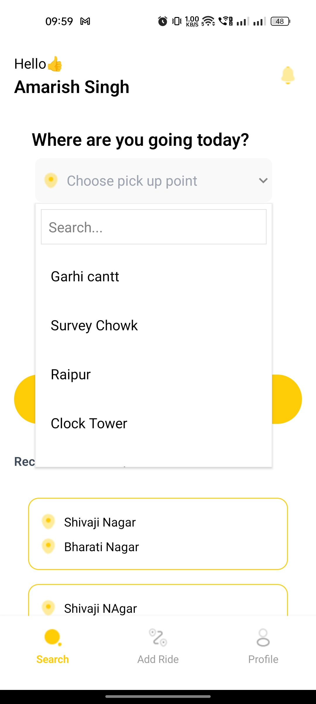

# hoppOn# HoppOn Ride-Sharing App 🚗

HoppOn is a ride-sharing app designed to make traveling more convenient in areas where public transport is unreliable, rare, or unavailable. Users can create events based on their routes, allowing others to share rides with them at minimal costs, similar to public transportation.

---

## 🎯 Features

- Users can create events specifying their routes.
- Riders can search for available rides based on route preferences.
- Allows for minimal ride charges similar to public transportation rates.
- Ideal for areas with limited or no public transport.

---

## 🛠️ Tech Stack

### Frontend:

- **React Native Expo**
- **JavaScript**
- **Tailwind CSS**

### Backend:

- **TypeScript**
- **Node.js**
- **PrismaDB**
- **MongoDB**
- **REST APIs**

---

## 📸 Screenshots

- **Index**

  

- **Profile**
  <!-- { width=300,height=200 } -->
  

- **Create Event**

  <!-- { width=300,height=200 } -->
  

- **Search Ride**

  <!-- { width=300,height=200 }
  { width=300,height=200 } -->
  
  

- **Search Results**

  <!-- { width=300,height=200 } -->
  

---

## ⚙️ Installation and Setup

1. **Clone the repository**:
   ```bash
   git clone https://github.com/your-username/hoppOn.git
   cd hoppOn
   ```
